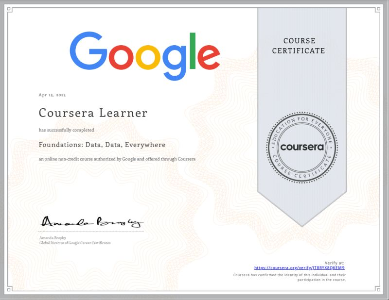

# Alguns dos meus Certificados

<table width="100%">
  <tr>
  <td width="50%"></td>
  <td width="50%"></td>
  </tr>
  <tr>
  <td width="50%"></td>
  <td width="50%"></td>
  </tr>
  <tr>
  <td width="50%"></td>
  <td width="50%"></td>
  </tr>
  <tr>
  <td width="50%"></td>
  <td width="50%"></td>
  </tr>
  <tr>
  <td width="50%"></td>
  <td width="50%"></td>
  </tr>
  <tr>
  <td width="50%"></td>
  <td width="50%"></td>
  </tr>
  <tr>
  <td width="50%"></td>
  <td width="50%"></td>
  </tr> 
  <tr>
  <td width="50%"></td>
  <td width="50%"></td>
  </tr>
  <tr>
  <td width="50%"></td>
  <td width="50%"></td>
  </tr>
  <tr>
  <td width="50%"></td>
  <td width="50%"></td>
  </tr>
  <tr>
  <td width="50%"></td>
  <td width="50%"></td>
  </tr>
  
</table>
